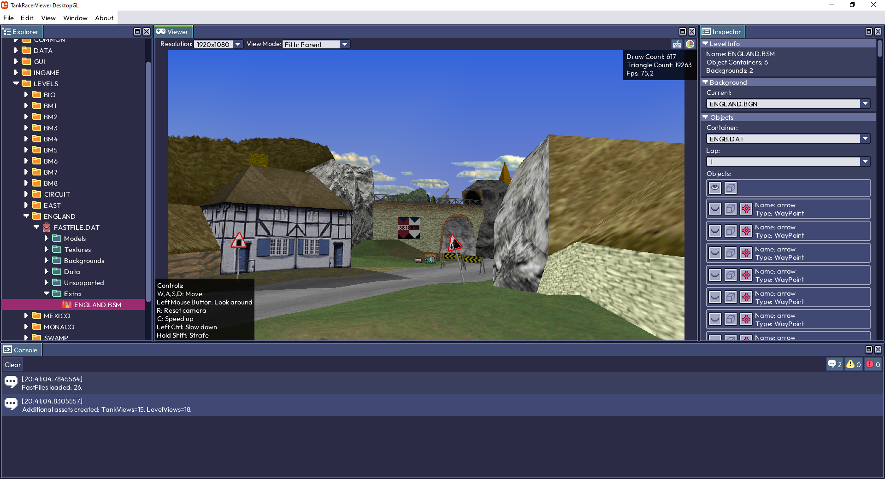

# 🕵 Tank Racer Viewer

## 🌐 Translations

| Language  | Link |
|---|---|
| 🇷🇺 Русский  | [Readme.md](docs/ru/Readme.md) |
| 🇬🇧 English | [Readme.md](Readme.md) |

---

## Example

Loading the GIF may take a few seconds ⏳  
  
  
[Watch demo (download mp4)](https://github.com/Bletraut/TankRacerViewer/raw/refs/heads/master/docs/content/Viewer.mp4)  

## 👀 What is this?

**Tank Racer Viewer** is a tool created through reverse engineering (strictly for educational and research purposes). It is designed to view resources stored in `.DAT` files (also known as FASTFILE) from the game *Tank Racer (1999)*.  

The tool is straightforward to use: launch the application and select the folder containing the Tank Racer game (you are expected to already have it 😉). After a short loading process, the program will parse all files and display their contents.  

At the moment, only resource viewing is supported - textures, models, levels, text data, etc. Exporting or repacking is not supported.

### Supported features:
✅ Viewing core game resources: textures, models, backgrounds, text files, tank models, levels  
✅ Rendering close to the original game: transparency, double-sided polygons, billboards  
✅ Ability to select background, lap number, and toggle object visibility on a level  
✅ Inspect which textures are used by a model and where they are applied  

### Known Issues:
⚠️ In the **DesktopGL** version on Windows (and possibly on macOS and Linux), when opening the file selection dialog using a keyboard shortcut (Ctrl+O), key release events are lost. As a result, the system continues to treat the keys as pressed until the next input event.

---

## 📂 Project Structure

The solution is split into several projects:

`FastFileUnpacker` - the most important part. A small library written in pure C#. Responsible for unpacking game files from *Tank Racer (1999)*. Created through reverse engineering of the game's file formats.

`ComposableUi` - the UI layer. A small library built on top of MonoGame. Created mainly for educational and experimental purposes. Inspired by the visual style of Aseprite, as well as Unity and Flutter.

`TankRacerViewer.Core` - the core of the project and its main logic.

`DesktopCommon` - shared code for desktop platforms.

`TankRacerViewer.WindowsDX` - Windows project using the DirectX backend.

`TankRacerViewer.DesktopGL` - cross-platform project (Windows, macOS, Linux) using OpenGL. Depends on NativeFileDialog.

---

## 🛠️ Technologies Used

This project is built on MonoGame and aims to be cross-platform. It works well on Windows (DirectX) and is expected to work on macOS and Linux via OpenGL (not tested).

- .NET 8  
- [MonoGame](https://monogame.net/)    
- HLSL for shaders  
- C# for application logic  

---

## 📖 How to Run

1. Clone the repository  
2. Install the .NET 8 SDK  
3. Open the solution in Visual Studio or Rider (MonoGame will be installed via NuGet automatically)  
4. Set either `TankRacerViewer.WindowsDX` or `TankRacerViewer.DesktopGL` as the startup project and run  